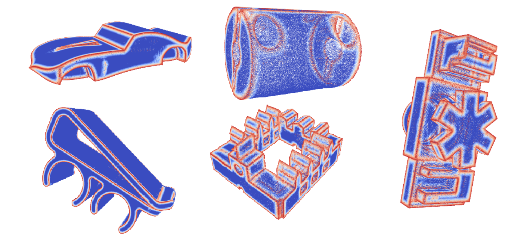

# How to run the code

Markup : 1. Please download the validation datasets at [validation.zip](https://www.dropbox.com/s/lxg7lb8xqcmxowa/validation.zip?dl=0)
         2. Put it to scripts/validation
         3(a). Use code from the "Execute_fuse_images.ipynb" file as an example of processing one pair of files
         3(b). or run "python fuse_images.py -t input_gt.hdf5 -p input_pred.hdf5 -o output_dir/" in the command line (check another flags in "fuse_images.py"
         4. For results visualosation put "results" folder to "scripts/validation/" and use code from "notebooks/gcv_v20211_hw1.ipynb"

# Resulting image

